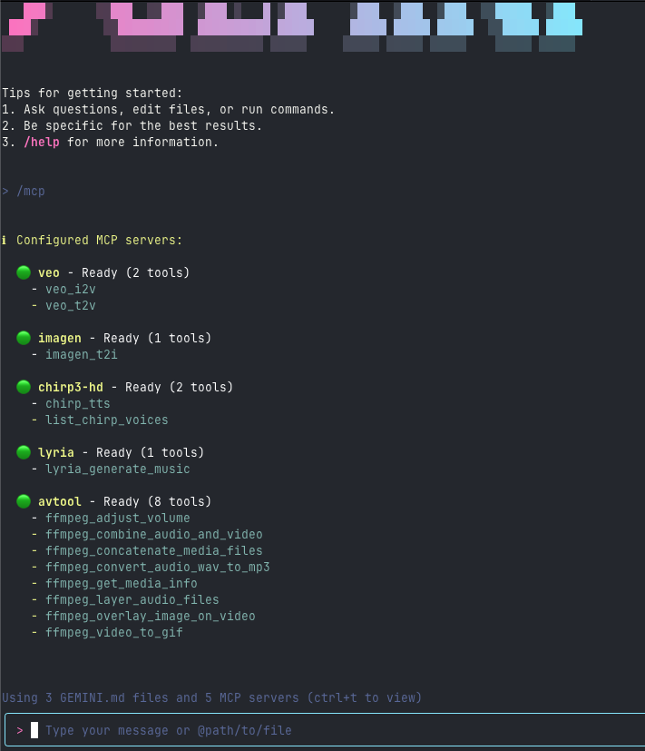

# MCP Servers for Genmedia x Gemini CLI

Use the MCP Servers for Genmedia with the [Gemini CLI](https://github.com/google-gemini/gemini-cli) ([launch announcement blog post](https://blog.google/technology/developers/introducing-gemini-cli-open-source-ai-agent/))


 
([full video](https://storage.googleapis.com/gweb-uniblog-publish-prod/original_videos/GenMedia_demo_keyword.mp4))


To install these MCP servers, please see [Installation](../../mcp-genmedia-go/README.md).

To configure these servers for gemini cli, you can either add these to your ~/.gemini/settings.json (see [Configuration](https://github.com/google-gemini/gemini-cli/blob/main/docs/cli/configuration.md#available-settings-in-settingsjson)) or create an Extension (preferred, [Extensions](https://github.com/google-gemini/gemini-cli/blob/main/docs/extension.md)).

## .gemini/settings.json: mcpServers

Add the following to your .gemini/settings.json `mcpServers` - you can do this at your ~/.gemini or per project directory.

A `sample_settings.json` is provided for your convenience.

```json
{
  "mcpServers": {
    "veo": {
      "command": "mcp-veo-go",
      "env": {
        "MCP_REQUEST_MAX_TOTAL_TIMEOUT": "240000",
        "MCP_SERVER_REQUEST_TIMEOUT": "30000",
        "GENMEDIA_BUCKET": "YOUR_GOOGLE_CLOUD_STORAGE_BUCKET",
        "PROJECT_ID": "YOUR_GOOGLE_CLOUD_PROJECT_ID"
      }
    },
    "imagen": {
      "command": "mcp-imagen-go",
      "env": {
        "MCP_SERVER_REQUEST_TIMEOUT": "55000",
        "GENMEDIA_BUCKET": "YOUR_GOOGLE_CLOUD_STORAGE_BUCKET",
        "PROJECT_ID": "YOUR_GOOGLE_CLOUD_PROJECT_ID"
      }
    },
    "chirp3-hd": {
      "command": "mcp-chirp3-go",
      "env": {
        "MCP_SERVER_REQUEST_TIMEOUT": "55000",
        "GENMEDIA_BUCKET": "YOUR_GOOGLE_CLOUD_STORAGE_BUCKET",
        "PROJECT_ID": "YOUR_GOOGLE_CLOUD_PROJECT_ID"
      }
    },
    "lyria": {
      "command": "mcp-lyria-go",
      "env": {
        "GENMEDIA_BUCKET": "YOUR_GOOGLE_CLOUD_STORAGE_BUCKET",
        "PROJECT_ID": "YOUR_GOOGLE_CLOUD_PROJECT_ID",
        "MCP_SERVER_REQUEST_TIMEOUT": "55000"
      }
    },
    "avtool": {
      "command": "mcp-avtool-go",
      "env": {
        "PROJECT_ID": "YOUR_GOOGLE_CLOUD_PROJECT_ID",
        "MCP_SERVER_REQUEST_TIMEOUT": "55000"
      }
    }
  }
}
```

Please note, you can add `"trust": true` to any of the MCP Servers to allow trusting the MCP server and its tools to bypass confirmations. See the [Configuration docs](https://github.com/google-gemini/gemini-cli/blob/main/docs/cli/configuration.md).

### Local Development and Tracing

If you are running a local OpenTelemetry (OTel) collector for tracing, you may need to configure the MCP servers to send traces to it using an insecure connection. You can do this by adding the `OTEL_EXPORTER_OTLP_INSECURE` environment variable to your `mcpServers` configuration in `settings.json` or your `gemini-extension.json` file.

Here is an example of how to configure the `veo` server to use an insecure connection:

```json
{
  "mcpServers": {
    "veo": {
      "command": "mcp-veo-go",
      "env": {
        "OTEL_EXPORTER_OTLP_INSECURE": "true",
        "MCP_REQUEST_MAX_TOTAL_TIMEOUT": "240000",
        "MCP_SERVER_REQUEST_TIMEOUT": "30000",
        "GENMEDIA_BUCKET": "YOUR_GOOGLE_CLOUD_STORAGE_BUCKET",
        "PROJECT_ID": "YOUR_GOOGLE_CLOUD_PROJECT_ID"
      }
    }
  }
}
```

When this variable is set to `"true"`, the MCP server will connect to the OTel collector without using TLS. This is useful for local development, but should not be used in production.


## .gemini/extensions/google-genmedia Extension

[Extensions](https://github.com/google-gemini/gemini-cli/blob/main/docs/extension.md) are the way to extend the gemini cli capabilities and bundle MCP servers.


First, create a directory for your extension - this can be at the home directory level (below), or per project directory.

```bash
mkdir -p ~/.gemini/extensions/google-genmedia-extension/
```

A `sample_extensions` directory is provided for your convenience.

Then, add to that directory a `gemini-extension.json`

```json
{
  "name": "google-genmedia-extension",
  "version": "1.0.0",

  "mcpServers": {
    "veo": {
      "command": "mcp-veo-go",
      "env": {
        "MCP_REQUEST_MAX_TOTAL_TIMEOUT": "240000",
        "MCP_SERVER_REQUEST_TIMEOUT": "30000",
        "GENMEDIA_BUCKET": "YOUR_GOOGLE_CLOUD_STORAGE_BUCKET",
        "PROJECT_ID": "YOUR_GOOGLE_CLOUD_PROJECT_ID"
      }
    },
    "imagen": {
      "command": "mcp-imagen-go",
      "env": {
        "MCP_SERVER_REQUEST_TIMEOUT": "55000",
        "GENMEDIA_BUCKET": "YOUR_GOOGLE_CLOUD_STORAGE_BUCKET",
        "PROJECT_ID": "YOUR_GOOGLE_CLOUD_PROJECT_ID"
      }
    },
    "chirp3-hd": {
      "command": "mcp-chirp3-go",
      "env": {
        "MCP_SERVER_REQUEST_TIMEOUT": "55000",
        "GENMEDIA_BUCKET": "YOUR_GOOGLE_CLOUD_STORAGE_BUCKET",
        "PROJECT_ID": "YOUR_GOOGLE_CLOUD_PROJECT_ID"
      }
    },
    "lyria": {
      "command": "mcp-lyria-go",
      "env": {
        "GENMEDIA_BUCKET": "YOUR_GOOGLE_CLOUD_STORAGE_BUCKET",
        "PROJECT_ID": "YOUR_GOOGLE_CLOUD_PROJECT_ID",
        "MCP_SERVER_REQUEST_TIMEOUT": "55000"
      }
    },
    "avtool": {
      "command": "mcp-avtool-go",
      "env": {
        "PROJECT_ID": "YOUR_GOOGLE_CLOUD_PROJECT_ID",
        "MCP_SERVER_REQUEST_TIMEOUT": "55000"
      }
    }
  }
}
```

Now, when you start up gemini cli you should see the mpc servers listed when issuing the slash command, `/mcp`



## Troubleshooting

### Error: spawn mcp-*-go ENOENT

If you encounter errors like the following when starting Gemini CLI:

```text
Error connecting to MCP server 'veo': failed to start or connect to MCP server 'veo' {"command":"mcp-veo-go","trust":true}; 
Error: spawn mcp-veo-go ENOENT
Error connecting to MCP server 'imagen': failed to start or connect to MCP server 'imagen' {"command":"mcp-imagen-go","trust":true}; 
Error: spawn mcp-imagen-go ENOENT
Error connecting to MCP server 'chirp3-hd': failed to start or connect to MCP server 'chirp3-hd' {"command":"mcp-chirp3-go","trust":true}; 
Error: spawn mcp-chirp3-go ENOENT
Error connecting to MCP server 'lyria': failed to start or connect to MCP server 'lyria' {"command":"mcp-lyria-go","trust":true}; 
Error: spawn mcp-lyria-go ENOENT
Error connecting to MCP server 'avtool': failed to start or connect to MCP server 'avtool' {"command":"mcp-avtool-go","trust":true}; 
Error: spawn mcp-avtool-go ENOENT
```

**Cause:** This error indicates that the Genmedia MCP server binaries (installed via Go) are not in your terminal's `PATH`. The Gemini CLI cannot locate the commands like `mcp-veo-go`, `mcp-imagen-go`, etc.

**Solution:** Add the Go binary directory to your `PATH`.

#### Temporary Fix (Current Terminal Session Only)

Run the following command in your terminal:

```bash
export PATH=$PATH:~/go/bin
```

This adds `~/go/bin` (the default location for Go-installed binaries) to your `PATH` for the current session only.

#### Permanent Fix (Recommended)

To ensure the Go binaries are always available, add the export command to your shell's configuration file:

**For Bash** (most common):

```bash
echo 'export PATH=$PATH:~/go/bin' >> ~/.bashrc
source ~/.bashrc
```

**For Zsh** (macOS default since Catalina):

```bash
echo 'export PATH=$PATH:~/go/bin' >> ~/.zshrc
source ~/.zshrc
```

**For Fish**:

```fish
fish_add_path ~/go/bin
```

**Note:** If you have a custom `GOBIN` or `GOPATH` set, adjust the path accordingly. You can check your Go environment with:

```bash
go env GOBIN
go env GOPATH
```

If `GOBIN` is set, use that path. Otherwise, use `$GOPATH/bin` or the default `~/go/bin`.

#### Verify the Fix

After updating your `PATH`, verify that the MCP servers are accessible:

```bash
which mcp-veo-go
which mcp-imagen-go
which mcp-chirp3-go
```

Each command should return a path like `/home/username/go/bin/mcp-veo-go`. If they do, your `PATH` is configured correctly.

You can also test individual servers directly:

```bash
mcp-imagen-go --help
```

This should display the help message for the Imagen MCP server without errors.