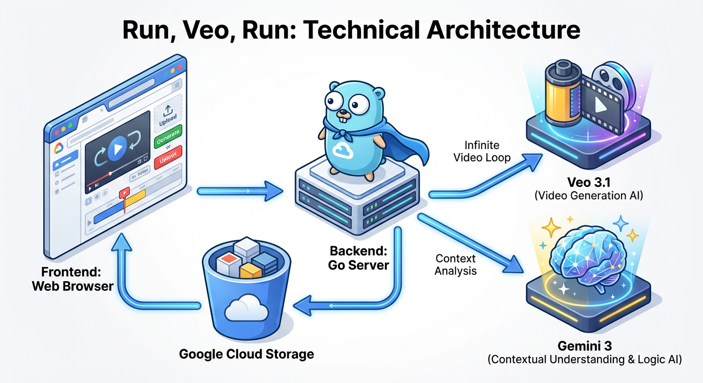

# Run, Veo, Run 🏃‍♀️📼

> *The ball is round. The game lasts 90 minutes. Everything else is pure theory.*

**Run, Veo, Run** is a real-time, multimodal video generation experiment. It creates an infinite, branching narrative loop using **Vertex AI Veo 3.1** for video extension and **Gemini 3** for context awareness.

Inspired by the kinetic energy of "Run, Lola, Run", the application features a techno-brutalist aesthetic designed for urgency and focus.

## 🌟 Features

*   **Infinite Extension:** Upload or generate a clip, then extend it indefinitely (5-7s segments).
*   **Advanced Generation Modes:**
    *   **Text-to-Video:** Classic prompt-based generation.
    *   **Image-to-Video:** Animate a static start frame.
    *   **Storyboard:** Guide the video from a Start Frame to a specific End Frame.
    *   **Ingredients:** Use up to 3 Reference Images (Assets) to control style and character consistency.
*   **Context Awareness:** Gemini 3 analyzes every generated clip to ensure style and character consistency in the next segment.
*   **Model Control:** Switch between `Veo 3.1 Fast` (Speed) and `Veo 3.1 Standard` (Quality). *Note: Ingredients mode requires Standard model.*
*   **Secure Playback:** Uses Signed URLs to securely stream generated content from Google Cloud Storage.

## 🏗️ Architecture



*   **Frontend:** Lit WebComponents + Tailwind CSS (Techno-Brutalist Theme).
*   **Backend:** Go (1.25+) acting as a secure proxy for Vertex AI and GCS.
*   **AI Models:**
    *   **Generation:** Veo 3.1 (`veo-3.1-fast-generate-preview`)
    *   **Analysis:** Gemini 3 (`gemini-3-pro-preview`)
*   **Infrastructure:** Cloud Run + Cloud Storage.

## 🚀 Setup & Configuration

### 1. Environment Setup
Copy the sample environment file and configure your project settings:

```bash
cp sample.env .env
# Edit .env with your specific Project ID and GCS Bucket
```

**Required Variables:**
*   `GOOGLE_CLOUD_PROJECT`: Your GCP Project ID.
*   `VEO_BUCKET`: A GCS bucket for storing generated videos (must exist).
*   `SERVICE_ACCOUNT_EMAIL`: The SA email (created in step 2).

### 2. Infrastructure
Run the setup script to create the required Service Account and assign IAM roles (Vertex AI User, Storage Object User, Logging):

```bash
./setup-sa.sh
```

### 3. Build & Run
**Local Development:**

For full functionality (especially video playback), you **must** impersonate the Service Account locally:

```bash
# Authenticate with impersonation
gcloud auth application-default login \
  --impersonate-service-account sa-run-veo-run@<YOUR-PROJECT-ID>.iam.gserviceaccount.com

# Start the server (Builds frontend & backend)
./build-run.sh
```

**Deployment:**
Deploy to Cloud Run with IAP enabled:
```bash
./deploy.sh
```

## 📜 License
Apache 2.0
