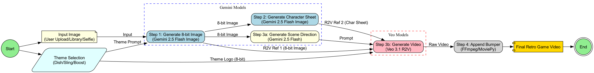

# Retro Games Workflow

This workflow transforms a user-uploaded image into a retro-themed video game asset and a short video clip, complete with a branded bumper.

## Overview

The workflow consists of four main steps:
1.  **8-bit Generation**: Converts the input image into an 8-bit pixel art style using Gemini 2.5 Flash Image.
2.  **Character Sheet Generation**: Creates a character sheet (front, side, back views, action poses) from the 8-bit image using Gemini 2.5 Flash Image.
3.  **Video Generation**:
    a.  Generates a scene direction using Gemini 2.5 Flash based on the 8-bit character.
    b.  Generates an 8-second video clip using Veo 3.1 (Reference-to-Video mode). It uses three reference images: the 8-bit character, the character sheet, and an 8-bit version of the selected theme's logo.
4.  **Bumper Appending**: Appends a pre-selected branded bumper video to the generated clip using FFmpeg.

## Prerequisites

-   **Models**:
    -   `gemini-2.5-flash` (or configured text model) for scene direction.
    -   `gemini-2.5-flash-image` (or configured image model) for 8-bit and character sheet generation.
    -   `veo-3.1-generate-preview` for video generation.
-   **Assets**:
    -   Bumper videos must be available in the configured GCS bucket (e.g., `gs://genai-blackbelt-fishfooding-assets/dish/oneten_glitch_0[1-3].mp4`).
    -   Brand logos (standard and 8-bit versions) for theme selection are configured in `workflows/retro_games_backend.py`.

## Usage

1.  Navigate to the **Retro Games** page in the application.
2.  **Input Image**:
    -   Upload an image from your device.
    -   Select an image from the Library.
    -   Take a selfie using the built-in camera.
3.  **Theme Selection**: Click on one of the brand logos (Dish, Sling, or Boost) to select the retro theme. This affects the color palette and style of the 8-bit generation, and uses the corresponding 8-bit logo in the video generation.
4.  Click **Generate Retro Game**.
5.  Wait for the process to complete. Intermediate results (8-bit image, character sheet) will appear as they are generated.
6.  The final video will be displayed and automatically saved to the Library.

## Technical Details

-   **Frontend**: `workflows/pages/retro_games.py` (Mesop UI).
-   **Backend**: `workflows/retro_games_backend.py` (Workflow logic).
-   **State Management**: Uses a `RetroGameWorkflowState` dataclass to track progress and artifacts through the steps.
-   **Video Processing**: Uses `moviepy` (via `models.video_processing`) to concatenate the generated video with the bumper.
-   **Resilience**: Includes automatic retries for image generation steps to handle transient failures.

## Troubleshooting

-   **Authentication Errors**: If you see GCS or API errors, ensure your application default credentials are valid (`gcloud auth application-default login`).
-   **Video Generation Failures**: Veo generation can sometimes fail due to safety filters or timeouts. Check the application logs for detailed error messages.
-   **FFmpeg Errors**: If appending the bumper fails, ensure `ffmpeg` is installed and accessible in the environment.
