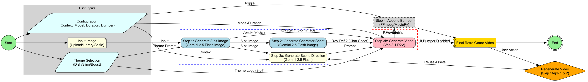

# Retro Games Workflow

This workflow transforms user-uploaded images into retro-themed video game assets and a short video clip, complete with a branded bumper. It supports both single-player and two-player "face-off" scenarios.

## Overview

The workflow consists of four main steps:
1.  **8-bit Generation**: Converts the input image(s) (Player 1 and optional Player 2) into an 8-bit pixel art style using Gemini 2.5 Flash Image.
2.  **Character Sheet Generation**: Creates character sheets (front, side, back views, action poses) for each player using Gemini 2.5 Flash Image.
3.  **Video Generation**:
    a.  Generates a scene direction using Gemini 2.5 Flash based on the characters and user-provided context.
    b.  Generates a video clip using Veo 3.1 (Reference-to-Video mode).
        *   **Single Player:** Uses 3 references: 8-bit Character, Character Sheet, and Theme Logo.
        *   **Two Player:** Uses 3 references: Composite P1 (8-bit + Sheet), Composite P2 (8-bit + Sheet), and Theme Logo.
4.  **Bumper Appending** (Optional): Appends a pre-selected branded bumper video to the generated clip using FFmpeg.

## Prerequisites

-   **Models**:
    -   `gemini-2.5-flash` (or configured text model) for scene direction.
    -   `gemini-2.5-flash-image` (or configured image model) for 8-bit and character sheet generation.
    -   `veo-3.1-generate-preview` (or compatible Veo 3+ model) for video generation.
-   **Libraries**:
    -   `pillow`: For image compositing in 2-player mode.
    -   `moviepy` / `ffmpeg`: For video concatenation.
-   **Assets**:
    -   Bumper videos must be available in the configured GCS bucket.
    -   Brand logos are configured in `workflows/retro_games/config.json`.

## Usage

1.  Navigate to the **Retro Games** page.
2.  **Inputs**:
    -   **Player 1**: Upload, select from Library, or take a Selfie.
    -   **Player 2 (Optional)**: Add a second character for a "versus" or cooperative scene.
3.  **Configuration**:
    -   **Theme Context**: Add custom direction (e.g., "in a futuristic neon city").
    -   **Model**: Select the Veo model version (defaults to Veo 3.1 Preview).
    -   **Scene Length**: Choose 4s or 8s.
    -   **Append Bumper**: Toggle the branded bumper on/off.
4.  **Theme Selection**: Click a brand logo (Dish, Sling, Boost) to set the visual style.
5.  Click **Generate Retro Game**.
6.  **Results**:
    -   View generated 8-bit avatars and character sheets.
    -   Watch the final video.
    -   **Regenerate Video Only**: Use this button to re-run the video generation step with new settings (e.g., different duration or context) without re-generating the character assets.

## Technical Details

-   **Directory Structure**: `workflows/retro_games/`
    -   `page.py`: Mesop UI logic.
    -   `backend.py`: Workflow logic and state management.
    -   `retro_games_config.py`: Configuration loader.
    -   `config.json`: Themes and asset paths.
    -   `prompts.json`: Text prompts for generation steps.
-   **State Management**: `RetroGameWorkflowState` dataclass tracks artifacts for multiple players.
-   **Image Compositing**: Uses `PIL` (Pillow) to combine the 8-bit avatar and character sheet into a single reference image when running in 2-player mode to respect the API's reference image limit.

## Troubleshooting

-   **"Internal Error" from Veo**: This often happens if the inputs are invalid (e.g., wrong aspect ratio) or if the model is overloaded. Check application logs.
-   **Video Generation Failures**: Ensure your quota allows for the selected duration and resolution.
-   **Missing Assets**: If "Regenerate" fails, ensure the intermediate assets (8-bit/sheets) haven't been deleted from GCS.